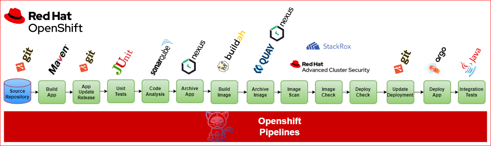
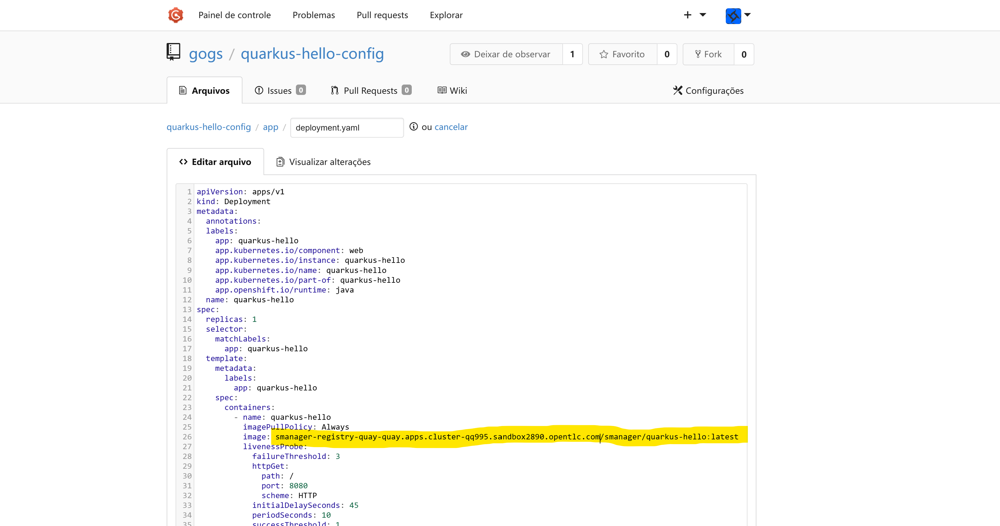
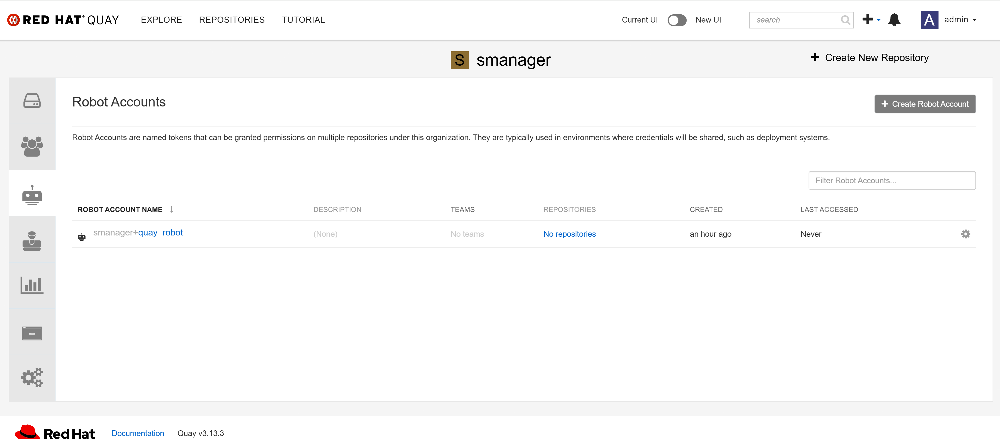
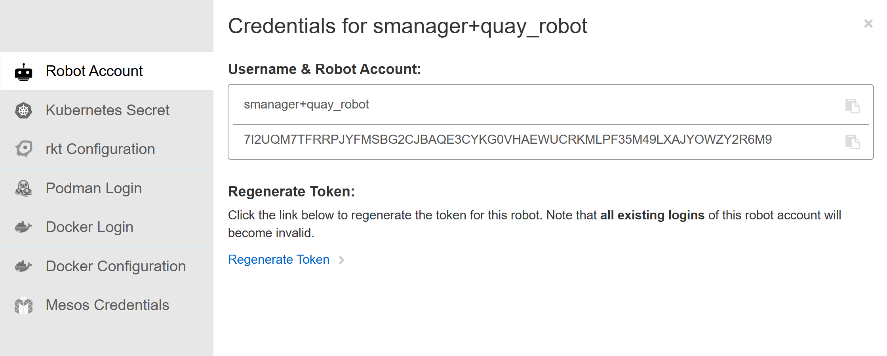
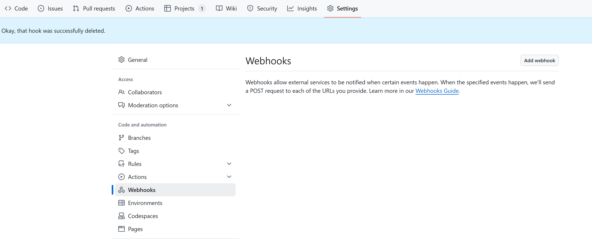
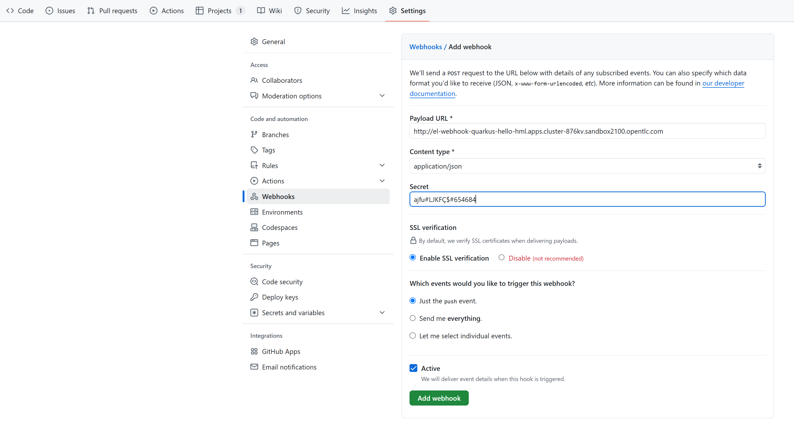
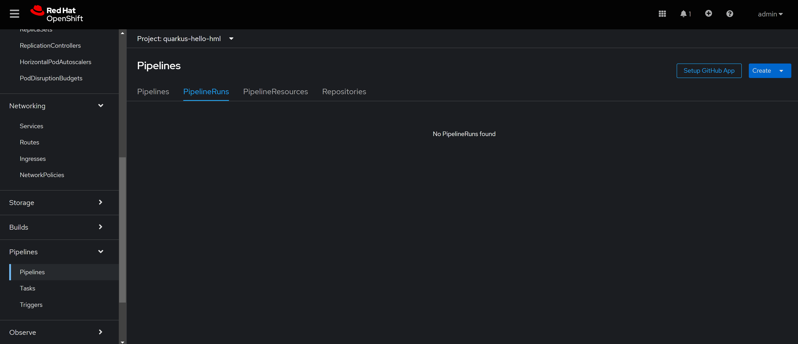
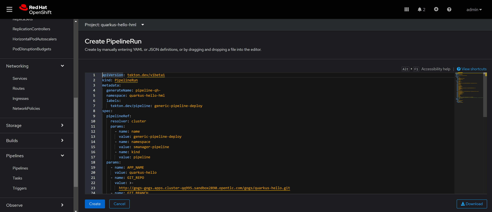

# Introdução
Este projeto visa a criação de um pipeline genérico para atender aplicações java sobre JBoss.<br>
É possivel encontrar aqui a instalação do ferramental e a criação da esteira e suas tasks.

Instalação / configuração: 1:30<br>
Quantidade de etapas: 14

# Ambientes para demonstração
[Gartner Magic Quadrant - DevOps Best Practices on Red Hat Openshift](https://catalog.partner.demo.redhat.com/catalog?category=favorites&item=babylon-catalog-prod%2Fpartner.ocp-gartner.prod) <br>
[Red Hat OpenShift Container Platform Cluster](https://catalog.partner.demo.redhat.com/catalog?category=favorites&item=babylon-catalog-prod%2Fpartner.ocpmulti-wksp-cnv.prod)


## Pré requisitos
### Ferramentas
- Uma máquina bastion com RHEL 8+
- Openshift Cluster 4.7+
- `oc` binary
- Ansible 2.7+
- Git

* [Install Ansible](https://docs.ansible.com/ansible/latest/installation_guide/intro_installation.html#installing-ansible-on-rhel-centos-or-fedora)

* [Install Kubernetes Ansible Module](https://docs.ansible.com/ansible/latest/collections/kubernetes/core/k8s_module.html)

```
ansible-galaxy collection install community.kubernetes
pip3 install kubernetes
pip3 install openshift
```

Algumas dependenicas extras do Python:

```
pip3 install jmespath
```

### Projeto

Ajustes básicos
- No arquivo all.yaml fazer os ajustes básicos
    - company_name
    - acs_central_password_base64
        - echo -n admin1234 | base64 R: YWRtaW4xMjM0
    - acs_central_password_plain_text
    - quay_admin_password
    - Criar um ServiceAccount e armazernar seu token em sa_cluster_admin_token
      - ```
        Executar /tools/criar-sa-cluster-adim.sh
        oc create sa cluster-admin-sa -n kube-system
        oc adm policy add-cluster-role-to-user cluster-admin -z cluster-admin-sa -n kube-system
        oc create token cluster-admin-sa -n kube-system --duration=999999h
        ```
    - sa_cluster_admin_token **com o token gerado pelos comandos acima**
    - cluster_url **aproveite para fazer um replace em todos os arquivos do projeto**
    - sonar_password
    - gogs_password
    - nexus_password
  
  
- No repositorio de config ajustar o arquivo deployment com a url da imagem do Quay<br>
  Ajustar somente o trecho do cluster url
   


- Criar rota do registry
  - ```
    oc patch configs.imageregistry.operator.openshift.io/cluster --patch '{"spec":{"defaultRoute":true}}' --type=merge
    oc get route -n openshift-image-registry
    ```
    
[//]: # (- Importar a imagem java do repositorio redhat para o registry do OCP<br>)

[//]: # (  - Acessar a página do container quarkus)

[//]: # (  - ```)

[//]: # (    https://catalog.redhat.com/software/containers/ubi9/openjdk-21/6501cdb5c34ae048c44f7814)

[//]: # (    ```)

[//]: # (    - Seguir as instruções do link no destaque amarelo abaixo, o arquivo gerado colar na pasta tools)

[//]: # (      ![img.png]&#40;imagens/openjdk-21.png&#41;)

[//]: # (    - Executar os comandos oc abaixo:)

[//]: # ( )
[//]: # (  - ```)

[//]: # (    oc create -f 6095290_tassinari-secret-redhat.yaml -n openshift)

[//]: # (    oc create -f kube-openjdk-21-pod.yaml -n openshift)

[//]: # (    oc import-image ubi9/openjdk-21:1.21-3 --from=registry.redhat.io/ubi9/openjdk-21:1.21-3 --confirm -n openshift)

[//]: # (    oc get is -n openshift | grep openjdk-21)

[//]: # (    oc delete pod kube-openjdk-21-pod -n openshift)

[//]: # (    oc delete secret 6095290-tassinari-pull-secret -n openshift)

[//]: # (    ```)

# Instalação
## RedHat Openshift Pipelines e RedHat Openshift GitOps
- No bastion autenticar no Openshift de des/hml
  ```
  oc login -u <user> -p <pass> --server=https://apps.cluster-qq995.sandbox2890.opentlc.com:6443
  ```
- No arquivo deploy_pipeline.yaml descomentar o bloco abaixo e executar o arquivo install.sh
  ```
    - name: 'Install Gitops and Pipeline'
      include_role:
        name: "1-ocp4-install-gitops-pipeline"
    ```
  Executar
  ```
  install.sh
  ```
- Create Namespaces  
- Get cluster version
- Create GitOps Operator Group
- Install GitOps Operator
- Get ArgoCD route
- Install OCP Pipelines Operator
- Configurar os Operators GitOps e Pipelines para serem executados nos infra-nodes<br>
  Ajustar no Subscription yaml
  
- ```
  spec:
    channel: latest
    config:
      nodeSelector:
        node-role.kubernetes.io/control-plane: ""
        node-role.kubernetes.io/master: ""
      tolerations:
      - effect: NoSchedule
        key: node-role.kubernetes.io/master
    ```
 - Pegar a senha do ArgoCD na openshift-gitops / secret / openshift-gitops-cluster para autenticação no console web  
  


## Advanced Cluster Security for Kubernetes
- No arquivo deploy_pipeline.yaml comentar o bloco anterior, descomentar o bloco abaixo e executar o arquivo install.sh
  - ```
    - name: 'Install the ACS Central'
      include_role:
      name: "2-ocp4-install-acs"
    ```
- Create Namespaces    
- Central
    - Get cluster version
    - Create ACS Central password
    - Install ACS Operator
    - Wait for ACS CRD to exist
    - Wait for ACS Operator to be up and running
    - Create ACS Central
    - Get central route
    - Wait for Central availability
- Secured Cluster
    - Get cluster init bundle
    - Create init-bundle secrets
    - Install Sensor on OpenShift Container Platform
    - Determine number of collectors
- Config Post ACS
    - Get ACS central route
    - Creating ACS Integration with the Openshift Internal Registry

# Install NooBaa
- No arquivo deploy_pipeline.yaml comentar o bloco anterior, descomentar o bloco abaixo e executar o arquivo install.sh
  ```
    - name: 'Install Pipeline'
      include_role:
      name: "3-ocp4-install-noobaa"
    ```
- Get cluster version
- Obtain Channel from Version
- Set Openshift Channel
- Create OpenShift Objects to install Noobaa
  - odf-namespace.yaml.j2
  - operatorgroup-storage.yaml.j2
  - odf-subscription.yaml.j2
- Create Noobaa Object
- Get Default Openshift Storage Class
- Get any other Storage Class
- Use default storage class if it was set
- Try other possible storage class if no defined/default storage class
- Create NooBaa Backing Store
- Patch Bucket Class with Backing Store


# Install Quay
- No arquivo deploy_pipeline.yaml comentar o bloco anterior, descomentar o bloco abaixo e executar o arquivo install.sh
  ```
    - name: 'Install Pipeline'
      include_role:
      name: "4-ocp4-install-quay"
    ```
- Verificar as variaveis no diretório **vars**
- install-quay
  - quay-namespace
  - quay-subscription
  - Wait for QuayRegistry CRD to exist
  - Create Quay Registry Object
- configure-quay
  - extract quay hostname
  - Wait until Quay Application is Responding
  - Initialize Quay User
  - Set Output Message from Quay on User Initalize
  - Use API Token to continue Creating
    - Set Quay Access Token
    - Create Quay Organization
    - Create Robot Account
    - Set Robot Token from Creating New Robot Account

## CICD Infra
- No arquivo deploy_pipeline.yaml comentar o bloco anterior, descomentar o bloco abaixo e executar o arquivo install.sh
  ```
    - name: 'Install Pipeline'
      include_role:
      name: "5-ocp4-install-cicd-infra"
    ```
- Verificar as variaveis no diretório **vars**  
- Create Namespaces
### Sonarqube
- Install sonarqube
- Get sonarqube route
- Wait for sonarqube to be running
    - Acessar o sonarqube e utilizar:<br>
      User: admin<br>
      Pass: admin<br>
      <br>
      Na sequência será solicitado atualizar a senha de administrador<br>
    - Criar token da conta admin <br>
      Clicar em Avatar / My Account / Security<br>
      <br>
      Copiar o token e armazenar em **bootstrap / group_vars / all.yaml / sonar_token**
  
### Reports
- Install Reports Repo ``` analisar se mantem; se sim criar um novo / analisar os parametros informados```
- Get reports route
- Wait for reports to be running

### Gogs
- Install Gogs ```trocar pelo Gitlab Operator ```
- Get gogs route
- Patch with specific route domain
- Wait for gogs and gogs-postgresql to be running
    ``` 
      Configurar senha 
      oc get pods
      oc rsh <nome do pod >
      su git
      ./gogs admin create-user --name gogs --password gogs --email root@xyz.com.br --admin
    
      Criar os repositorios e subir codigo fonte 
      quarkus-hello
          git clone http://gogs-gogs.apps.cluster-qq995.sandbox2890.opentlc.com/gogs/quarkus-hello.git
          cp -r quarkus-hello-orig/* quarkus-hello
          cd quarkus-hello
          git add .
          git commit -m "First Commit"
          git push -u origin master
          cd ..
      quarkus-hello-config
          git clone http://gogs-gogs.apps.cluster-qq995.sandbox2890.opentlc.com/gogs/quarkus-hello-config.git
          cp -r quarkus-hello-config-orig/* quarkus-hello-config
          cd quarkus-hello-config
          git add .
          git commit -m "First Commit"
          git push -u origin master
          cd .. 
      ```
### Nexus
- Install Nexus
- Get nexus route
- Check Nexus Route
- Wait for nexus to be running
  -  ```
      Your admin user password is located in
      /nexus-data/admin.password on the server.
   
      oc project nexus
      oc get pods
      oc rsh <nome do pod>
      cat /nexus-data/admin.password 
      ```
- Criar um repositorio maven-redhat do tipo proxy no nexus<br>
  - ```
    relase<br>
    permissive<br>
    https://maven.repository.redhat.com/ga/ <br>
    ```
- No repositorio maven-public associar com o
  - ``` 
    maven-redhat  
    ```    
- Alterar o campo Layout policy do repositorio maven-releases para
  - ```
    permissive<br>
    ```

# Install Pipelines
- No arquivo deploy_pipeline.yaml comentar o bloco anterior, descomentar o bloco abaixo e executar o arquivo install.sh
    ```
    - name: 'Install Pipeline'
      include_role:
      name: "6-ocp4-install-pipeline"
    ```
- Verificar as variaveis no diretório **vars**  
- Create Namespaces
- pipelines.yaml
    - Get argocd password
    - Add CM for ArgoCD env in namespace
    - Add Secrets for ArgoCD env in namespace
    - Create OpenShift Objects for Openshift Pipeline Tasks
      - task-rox-image-check.yaml.j2
      - task-rox-deployment-check.yaml.j2
      - task-rox-image-scan.yaml.j2
      - task-integration-tests.yaml.j2
      - task-build-quarkus-image.yaml.j2
      - task-argo-sync-and-wait.yaml.j2
      - task-git-update-deployment.yaml.j2
      - task-git-clone.yaml.j2
      - task-maven.yaml.j2
      - cm-maven.yaml.j2
      - task-s2i-java.yaml.j2
      - task-update-release.yaml.j2
      - task-dependency-report.yaml.j2

    - Create OpenShift Objects for Openshift Pipeline Triggers
      - trigger-eventlistener.yaml.j2
      - rt-trigger-eventlistener.yaml.j2
      - triggerbinding-trigger-gogs.yaml.j2
      - triggertemplate.yaml.j2

    - Create OpenShift Objects for Openshift Pipelines Templates
        - generic-pipeline.yaml.j2
        - pipeline-build-pvc.yaml.j2
  
- acs-token-for-pipeline.yaml
    - Get ACS central route
    - Create API token for access from Pipeline to ACS
    - Get API token from response
    - Create ACS API Token secret for using in the pipelines

# Install Application
- No arquivo deploy_pipeline.yaml comentar o bloco anterior, descomentar o bloco abaixo e executar o arquivo install.sh
    ```
    - name: 'Install Application'
      include_role:
      name: "7-install-application"
    ```

- Atualizar o arquivo vars/main.yaml
    - webhook_secret_token
    - Quay
        - quay_route
        - quay_robot_token<br>
          Copirar o robot token da organização SMANAGER
          
          
      
      - quay_application_access_token<br>
        https://docs.redhat.com/en/documentation/red_hat_quay/3/html-single/red_hat_quay_api_guide/index#creating-oauth-access-token
        
        
        
        
        - ATENÇÃO:<br>
          A url do Quay tem um certificado auto assinado desta forma foi necessário ajustar o cluster para poder baixar uma imagem de um repositorio com certificado inválido.<br>
          Editar o image.config.openshift.io
          ```
          oc edit image.config.openshift.io/cluster
          ```
          Acrescescentar o trecho abaixo
          ```
          spec:
            registrySources:
              insecureRegistries:
              - smanager-registry-quay-quay.apps.cluster-qq995.sandbox2890.opentlc.com
          ```
          [Allowing Insecure Registry](https://docs.redhat.com/en/documentation/openshift_container_platform/4.17/html/images/image-configuration#images-configuration-insecure_image-configuration)

- Create Namespaces
- Add a label to enable the secure HTTPS connection to the Eventlistener resource
- Get gogs route
- Create ArgoCD App project
- Create ArgoCD Hml App
- Create ArgoCD Prd App
- Add Gitops Rolebinding
- Add RoleBinding to the pipeline namespace
- Quay
  - Extract quay hostname   
  - Set Quay hostname
  - Wait until Quay Application is Responding
  - Use API Token to continue Creating
    - Create Repository
    - Add Robot account permissions to repo
  - Create Quay Secret in Namespaces that require secret
  - Create Quay Secret in Pipeline Namespace project

# Triggers

Acesse o repositório Git clique nas seguintes opções:
[Creating Webhooks](https://docs.openshift.com/pipelines/1.17/create/creating-applications-with-cicd-pipelines.html#creating-webhooks_creating-applications-with-cicd-pipelines)
1. **Settings > Webhooks > Add webhook**

2. **Payload URL:** *colar a rota do EventListener*
3. **Tipo de Conteudo:** *appication/json*
4. **Secret** *colar o valor da variavel* ***main/webhook_secret_token***
5. **Which events would you like to trigger this webhook?** *Just the push event.*
6. **Active:** *checked*
7. **Add Webhook**


# Executar a Pipeline
1. No Openshift acessar o menu Pipelines, escolher o projeto da aplicação, clicar em PipelineRuns e botão Create / PipelineRun.

2. Copiar o conteudo de **7-install-application/qh-pipelinerun.yaml**


# Certmanager e Gitlab
- No arquivo deploy_pipeline.yaml comentar o bloco anterior, descomentar o bloco abaixo e executar o arquivo install.sh
    ```
    - name: 'Install Gitlab'
      include_role:
        name: "9-install-gitlab"
    ```
- Create Namespaces
- Cert Manager
  - Criar OperatorGroup
  - Criar Subscription
  - Criar ClusterIssuer
-Gitlab
  - Create OperatorGroup
  - Create Subscription
  - Deploy GitLab Custom Resource
  - Get all Gitlab routes
  - Wait for route Gitlab with the desired prefix to appear
  - Get Gitlab password
  - Decode base64 Gitlab Password
  - Wait for Gitlab availability


# Divirta-se!


# Info
[RedHat Openshift Pipelines](https://docs.openshift.com/pipelines/1.17/about/about-pipelines.html)

[OpenShift Pipelines Tasks Catalog](https://github.com/openshift/pipelines-catalog)

[Tekton Tasks Catalog](https://github.com/tektoncd/catalog)

[Red Hat Cert Manager](https://docs.openshift.com/container-platform/4.17/security/cert_manager_operator/)
 

# -------------------------------------------------------------------------
# Comandos para testes locais da aplicação
# quarkus-hello

This project uses Quarkus, the Supersonic Subatomic Java Framework.

If you want to learn more about Quarkus, please visit its website: https://quarkus.io/ .

## Running the application in dev mode

You can run your application in dev mode that enables live coding using:
```shell script
./mvnw compile quarkus:dev
```

> **_NOTE:_**  Quarkus now ships with a Dev UI, which is available in dev mode only at http://localhost:8080/q/dev/.

## Packaging and running the application

The application can be packaged using:
```shell script
./mvnw package
```
It produces the `quarkus-run.jar` file in the `target/quarkus-app/` directory.
Be aware that it’s not an _über-jar_ as the dependencies are copied into the `target/quarkus-app/lib/` directory.

The application is now runnable using `java -jar target/quarkus-app/quarkus-run.jar`.

If you want to build an _über-jar_, execute the following command:
```shell script
./mvnw package -Dquarkus.package.jar.type=uber-jar
```

The application, packaged as an _über-jar_, is now runnable using `java -jar target/*-runner.jar`.

## Creating a native executable

You can create a native executable using:
```shell script
./mvnw package -Dnative
```

Or, if you don't have GraalVM installed, you can run the native executable build in a container using:
```shell script
./mvnw package -Dnative -Dquarkus.native.container-build=true
```

You can then execute your native executable with: `./target/code-with-quarkus-1.0.0-SNAPSHOT-runner`

If you want to learn more about building native executables, please consult https://quarkus.io/guides/maven-tooling.

## Related Guides

- RESTEasy Reactive ([guide](https://quarkus.io/guides/resteasy-reactive)): A Jakarta REST implementation utilizing build time processing and Vert.x. This extension is not compatible with the quarkus-resteasy extension, or any of the extensions that depend on it.

## Provided Code

### RESTEasy Reactive

Easily start your Reactive RESTful Web Services

[Related guide section...](https://quarkus.io/guides/getting-started-reactive#reactive-jax-rs-resources)


# -------------------------------------------------------------------------
# TODO
- Reports -fazer funcionar
- 4. PostCI - Pentesting and Performance Tests
- 5. Notifications
- 6. Image Signing and Pipeline Signing
- Testar
    - name: Search for Pods labelled name=gogs
      kubernetes.core.k8s_info:
      kind: Pod
      namespace: gogs
      label_selectors:
      - name = gogs
      register: result

    - name: Display Pod Name
      debug:
      var: result.resources.0.metadata.name

    - name: Executar comando
      kubernetes.core.k8s_exec:
      namespace: gogs
      pod: "{{ result.resources.0.metadata.name }}"
      command: su git -c './gogs admin create-user --name=root --password=Smanager00# --email=root@xyz.com.br --admin'
      register: resultado_execucao

    - name: Exibir saída do comando
      debug:
      var: resultado_execucao.stdout_lines


- Autorização manual
  - Somente na versão 1.17 do pipelines<br>
    Consegui instalar a 1.14, a 1.17 ainda dá pau <br>
    Testar depois <br> 
    [Using manual approval in OpenShift Pipelines](https://docs.openshift.com/pipelines/1.17/create/using-manual-approval.html)


# FINITO !!!

