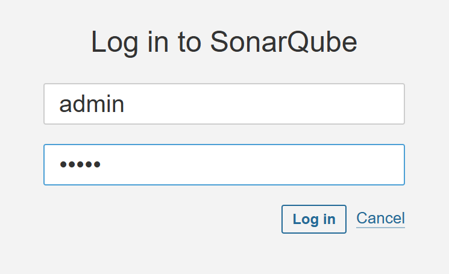

<p align="center">
  
</p>

# Introdução
Este projeto visa a criação de um pipeline genérico para atender aplicações java sobre JBoss.

É possivel encontrar aqui a instalação do ferramental e a criação da esteira e suas tasks.

## Contas
- ArgoCD
    - rota: https://openshift-gitops-server-openshift-gitops.apps.kilpro4820.pro.intra.rs.gov.br
    - user: admin
    - pass: ****************

- Nexus
  - rota:
  - user: admin
  - pass: admin1234
  
- Sonarqube
    - rota: https://sonarqube.apps.kildes4830.des.intra.rs.gov.br
    - user: admin
    - pass: ****************

- ACS
    - rota: 
    - user: admin
    - pass: admin1234

- Quay
    - rota: 
    - user: admin
    - pass: admin1234

## Clusters
[Produção](https://console-openshift-console.apps.kilpro4820.pro.intra.rs.gov.br/)<br>
[Homologação](https://console-openshift-console.apps.kildes4830.des.intra.rs.gov.br/)
## Pré requisitos
### Ferramentas
- Uma máquina bastion com RHEL 8+
- Openshift Cluster 4.7+
- `oc` binary
- Ansible 2.7+
- Git

* [Install Ansible](https://docs.ansible.com/ansible/latest/installation_guide/intro_installation.html#installing-ansible-on-rhel-centos-or-fedora)

* [Install Kubernetes Ansible Module](https://docs.ansible.com/ansible/latest/collections/kubernetes/core/k8s_module.html)

```
ansible-galaxy collection install community.kubernetes
pip3 install kubernetes
pip3 install openshift
```

Algumas dependenicas extras do Python:

```
pip3 install jmespath
```

### Projeto

1.	Ajustes básicos
- No arquivo deploy_pipeline.yaml fazer os ajustes básicos
    - company_name
    - acs_central_password_base64
        - echo -n admin1234 | base64 R: YWRtaW4xMjM0
    - acs_central_password_plain_text
    - quay_admin_password
- Criar um ServiceAccount e armazernar seu token em sa_cluster_admin_token
  - ```
    Executar /tools/criar-sa-cluster-adim.sh
    oc create sa cluster-admin-sa -n kube-system
    oc adm policy add-cluster-role-to-user cluster-admin -z cluster-admin-sa -n kube-system
    oc create token cluster-admin-sa -n kube-system --duration=999999h
    ```
- cluster_url
- nexus_password


- Criar rota do registry
  - ```
    oc patch configs.imageregistry.operator.openshift.io/cluster --patch '{"spec":{"defaultRoute":true}}' --type=merge
    oc get route -n openshift-image-registry
    ```
    
- Importar a imagem java do repositorio redhat para o registry do OCP<br>
  - Acessar a página do container quarkus
  - ```
    https://catalog.redhat.com/software/containers/ubi9/openjdk-21/6501cdb5c34ae048c44f7814
    ```
    - Seguir as instruções do link no destaque amarelo abaixo, o arquivo gerado colar na pasta tools
      
    - Executar os comandos oc abaixo:
 
  - ```
    oc create -f 6095290_tassinari-secret-redhat.yaml -n openshift
    oc create -f kube-openjdk-21-pod.yaml -n openshift
    oc import-image ubi9/openjdk-21:1.21-3 --from=registry.redhat.io/ubi9/openjdk-21:1.21-3 --confirm -n openshift
    oc get is -n openshift | grep openjdk-21
    oc delete pod kube-openjdk-21-pod -n openshift
    oc delete secret 6095290-tassinari-pull-secret -n openshift
    ```

# Instalação
## RedHat Openshift Pipelines e RedHat Openshift GitOps
- No arquivo deployment_pipeline.yaml descomentar o bloco e executar o arquivo install.sh
  - ```
    - name: 'Install Gitops and Pipeline'
      include_role:
        name: "1-ocp4-install-gitops-pipeline"
    ```
- Get cluster version
- Create GitOps Operator Group
- Install GitOps Operator
- Install OCP Pipelines Operator
- Get ArgoCD route
- Configurar os Operators GitOps e Pipelines para serem executados nos infra-nodes<br>
  Ajustar no Subscription yaml
  
  - ```
    spec:
      channel: latest
      config:
        nodeSelector:
          env: ocp-infra-dev
          node-role.kubernetes.io/infra: ''
        tolerations:
          - effect: NoSchedule
            key: node-role.kubernetes.io/infra
            value: reserved
          - effect: NoExecute
            key: node-role.kubernetes.io/infra
            value: reserved
    ```
 - Pegar a senha do ArgoCD na openshift-gitops / secret / openshift-gitops-cluster para autenticação no console web  
  
- Install OCP Pipelines Operator


## Advanced Cluster Security for Kubernetes
- No arquivo deployment_pipeline.yaml comentar o bloco anterior, descomentar o bloco abaixo e executar o arquivo install.sh
  - ```
    - name: 'Install the ACS Central'
      include_role:
      name: "2-ocp4-install-acs"
    ```
- Central
    - Get cluster version
    - Create ACS namespace
    - Create ACS Central password
    - Install ACS Operator
    - Wait for ACS CRD to exist
    - Wait for ACS Operator to be up and running
    - Create ACS Central
    - Get central route
    - Wait for Central availability
- Secured Cluster
    - Get cluster init bundle
    - Create init-bundle secrets
    - Install Sensor on OpenShift Container Platform
    - Determine number of collectors
- Config Post ACS
    - Get ACS central route
    - Creating ACS Integration with the Openshift Internal Registry

# Install Quay
- install-quay
- - quay-namespace
- - quay-subscription
- - Wait for QuayRegistry CRD to exist
- - Create Quay Registry Object
- configure-quay
- - extract quay hostname
- - Wait until Quay Application is Responding
- - Initialize Quay User
- - Set Output Message from Quay on User Initalize
- - Use API Token to continue Creating
- - - Set Quay Access Token
- - - Check if Quay Organization Exists
- - - Create Quay Organization
- - - Check if Repository Already Exists
- - - Create Repository
- - - Check if Robot Account Already Exists
- - - Set Robot Token from Check Response
- - - Create Robot Account
- - - Set Robot Token from Creating New Robot Account
- - - Add Robot account permissions to repo
- - Delete any Previously Existing Quay Secret
- - Create Quay Secret in Namespaces that require secret
- - Confirm Quay Secret is Created


- Copirar o robot token e atualizar no deployment_pipeline.yaml a variavel
  - ```
    quay_robot_token
    ```
- Gerar token no quay e atualizar no deployment_pipeline.yaml a variavel
  - ```
    https://docs.redhat.com/en/documentation/red_hat_quay/3/html-single/red_hat_quay_api_guide/index#creating-oauth-access-token
    
    quay_access_token
    ```

## CICD Infra
### Sonarqube
- Install sonarqube
- Get sonarqube route
- Wait for sonarqube to be running
    - Acessar o sonarqube e utilizar:<br>
      User: admin<br>
      Pass: admin<br>
      <br>
      Na sequência será solicitado atualizar a senha de administrador<br>
    - Criar token da conta admin <br>
      Clicar em Avatar / My Account / Security<br>
      <br>
      Copiar o token e armazenar em deploy_pipeline / sonar_token
  

- Install Reports Repo ``` analisar se mantem; se sim criar um novo / analisar os parametros informados```
- Get reports route
- Wait for reports to be running
- Install Gogs ```trocar pelo Gitlab Operator ```
  -  ``` 
      Configurar senha 
      oc get pods
      oc rsh <nome do pod >
      su git
      ./gogs admin create-user --name gogs --password gogs --email root@xyz.com.br --admin

      Criar os repositorios 
      quarkus-hello
      quarkus-hello-config
      Subir codigo fonte
      ```
- Get gogs route
- Patch with specific route domain
- Wait for gogs and gogs-postgresql to be running
- Install Nexus
- Get nexus route
- Check Nexus Route
- Wait for nexus to be running
  -  ```
      Your admin user password is located in
      /nexus-data/admin.password on the server.
   
      oc project nexus
      oc get pods
      oc rsh <nome do pod>
      cat /nexus-data/admin.password 
      ```
- Criar um repositorio maven-redhat do tipo proxy no nexus<br>
  - ```
    relase<br>
    permissive<br>
    https://maven.repository.redhat.com/ga/ <br>
    ```
- No repositorio maven-public associar com o
  - ``` 
    maven-redhat  
    ```    
- Alterar o campo Layout policy do repositorio maven-releases para
  - ```
    permissive<br>
    ```

# Install Pipelines

- pipelines.yaml
- Create Namespaces
- pipelines.yaml
    - Get argocd password
    - Add CM for ArgoCD env in namespace
    - Add Secrets for ArgoCD env in namespace
    - Create OpenShift Objects for Openshift Pipeline Tasks
        - clustertask-rox-deployment-check.yaml.j2
        - clustertask-rox-image-check.yaml.j2
        - clustertask-rox-image-scan.yaml.j2
        - cm-maven.yaml.j2
        - task-argo-sync-and-wait.yaml.j2
        - task-build-quarkus-image.yaml.j2
        - task-dependency-report.yaml.j2
        - task-git-clone.yaml.j2
        - task-git-update-deployment.yaml.j2
        - task-maven.yaml.j2
        - task-s2i-java.yaml.j2
        - task-update-release.yaml.j2

    - Create OpenShift Objects for Openshift Pipeline Triggers
        - rt-trigger-eventlistener.yaml.j2
        - trigger-eventlistener.yaml.j2
        - trigger-eventlistener-route.yaml.j2
        - trigger-gogs-triggerbinding.yaml.j2
        - triggertemplate.yaml.j2

    - Create OpenShift Objects for Openshift Pipelines Templates
        - generic-pipeline.yaml.j2
        - pipeline-build-pvc.yaml.j2
  
- acs-token-for-pipeline.yaml
    - Get ACS central route
    - Store central route as a fact
    - Create API token for access from Pipeline to ACS
    - Get API token from response
    - Create ACS API Token secret for using in the pipelines

- secret-quay.yaml
    - Extract quay hostname
    - Wait until Quay Application is Responding
    - Create Quay Secret in Namespaces that require secret
    - Confirm Quay Secret is Created


# Install Application

- Atualizar o arquivo defaults/main.yaml
- Create Namespaces
- Get gogs route
- Create ArgoCD App project
- Create ArgoCD Hml App
- Create ArgoCD Prd App
- Add Gitops Rolebinding
- Add RoleBinding to the pipeline namespace
- Quay
  - Extract quay hostname   
  - Set Quay hostname
  - Wait until Quay Application is Responding
  - Use API Token to continue Creating
    - Create Repository
    - Add Robot account permissions to repo
  - Create Quay Secret in Namespaces that require secret
  - Confirm Quay Secret is Created

# Criar o container Tools personalizado
- Ajustar as urls do OCP e do registry nos arquivos rum.sh e Dockerfile
  - tools/run.sh


# FINITO !!! 


# Contas
ArgoCD<br>
user: admin<br>
pass: AixwT7nmyGCZX4P9EoM8eUqWKDgQhlt1

Acs<br>
user: admin<br>
pass: xpto -> cHJPYzNyZ3NAMjAyNCM=

Quay<br>
user: admin
pass: xpto

Sonarqube<br>
user: admin
pass: xpto

Nexus<br>
user: admin
pass: xpto

Gogs<br>
user: gogs
pass: gogs
------------------------------------------
Mostrar 
Url: 
   ArgoCD
   ACS
   Quay
   Gogs
   Nexus
   Sonarqube
   Report


Passwd:
   ArgoCD
   ACS
   Quay
   Gogs
   Nexus
   Sonarqube

---------------------------


.


######################################################################################################################################################
outra coisa

## 1- Deploy da aplicação com Pipeline:

1. Altere para o perfil de desenvolvedor
2. Selecione o menu +Add;
3. Em "**Project: All Projects**" clicar em "**Create Project**";
    1. Name: **"<"suas iniciais">"-tst-pipeline**
4. Clicar em "**+Add > Git Repository > Import from Git**";
5. Preencha os dados solicitados:
    - **Git Repo URL:** *insira a url do projeto tst-pipeline*;
    - **Git type:** *GitHub*
    - Clique em **Show advanced Git options**
        - **Git Reference:** *master*
        - **Context dir:** */*
    - **Import Strategy:** *Builder Image > Java > Red Hat OpenJDK 11 (UBI 8)*
    - **Appplication name:** *"<suas iniciais">"-pipeline-app*
    - **Name:** *"<suas iniciais">"-pipeline*
    - **Resources:** *Deployment*
    - **Pipelines:** *Add pipeline*
    - **Target port:** *8080*
    - **Create a route to the Application:** Desmarcar;
    - **Resource limits:** Cilcar;
    - No formulario que será aberto, preencha com os seguintes valores:
        - CPU -> Request = 20 milicores;
        - CPU -> Limit = 50 milicores;
        - Memory -> Request = 70 Mi;
        - Memory -> Limit = 150 Mi;
    - Clique no botão "Create";
   >
   >- Aguarde o processo de construção (build) e escalação da aplicação (0 para 1).
   >- Acompanhe os logs da execução em: **Pipelines > "<suas iniciais">"-pipeline > Task status**;
   >- Clique em **Topology** ;
   >- Clique em cima do circulo azul da sua aplicação **"<suas iniciais">"-pipeline**;
   >- Explore as opções apresentadas (Details, Resources, Observe);

## 2 - Crie uma rota HTTP para a aplicação:
1. Clique em **Project** no menu esquerdo do console;
2. Clique em **Route > Create Route**, e preencha conforme abaixo:
    - **Name**: rt-pipeline
    - **Hostname**:  *<"suas iniciais>"-pipeline.<dominio openshift>*
    - **Path:** */*
    - **Service**: *<"nome do serviço>"*
    - **Target port**: *8080 -> 8080 (TCP)*
    - Clicar em **Create**;
    - Acesse a rota em seu navegador;
    - Anote a rota em um bloco de notas;

## 3 - Crie uma rota HTTPS para a aplicação:
1. Clique em **Project** no canto esquerdo do console;
2. Clique em **Route** > **Create Route**, e preencha conforme abaixo:
    - **Name**: rt-sec-pipeline
    - **Hostname**: *<"suas iniciais>"-sec-pipeline.<dominio openshift>*
    - **Service**: *<"nome do serviço>"*
    - **Target port**: 8080 -> 8080 (TCP)
    - Marque o checkbox **Secure Route**;
    - **TLS termination**: Edge
    - **Insecure traffic**: Redirect
    - Clicar em **Create**;
    - Acesse a rota em seu navegador;
    - Tente acessar a rota como HTTP e veja o comportamento do "Redirect";

## 4 - Adicionar Trigger/Webhook no Pipeline:

1. Clique em **Topology** e abra a URL do Container chamado *"Triggers"*
2. Copie a URL;
3. Acesse o repositório no Gogs e clique nas seguintes opções:
    1. **Settings > Webhooks > Add webhook**
    2. **Payload URL:** *colar a url do Trigger copiada no passo anterior
    3. **Tipo de Conteudo:** *appication/json*
    4. **Secret** *deixar em branco*
    5. **Which events would you like to trigger this webhook?** *Just the push event.*
    6. **Active:** *checked*
    7. **Add Webhook**

## 5 - Teste de Trigger com o Webhook do Gogs:

#### Passos para teste:

Acessar o repositorio no Gogs.

1. Acessar o arquivo **"/src/main/java/br/com/smananager/hello/HelloApplication.java"**.
2. Clicar no Lapis para editar o arquivo
3. Alterar a **linha 14** substituindo a frase *"Hello World"* por *"Ola Mundo"*
4. Após essa alteração clique no botão **"Commit changes"**;
5. No console do OCP, voce pode acompahar a Pipeline iniciando um novo build e deploy da nova versão da Aplicação;

